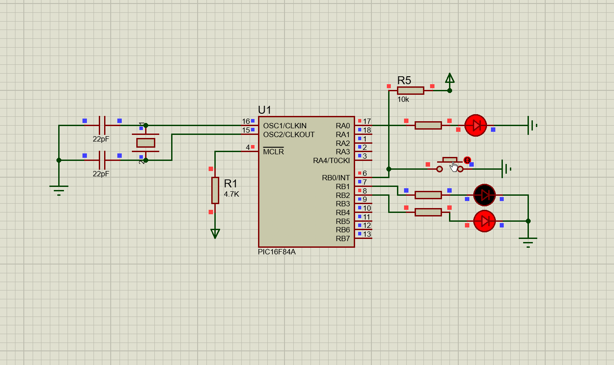

 
 

<!-- BAŞLIK -->
<h1> 
  

     PIC16 PROJECTS
  

</h1>

 
 
 

<!-- NAVIGATION -->
                        

<h4> Navigation : </h4> 
- <a href="https://github.com/enesmrcn/PIC-MCU-Projects/tree/main/PIC16-C-PROJECTS-main/00_helloWorldLED">  00_helloWorldLED </a> 
- <a href="https://github.com/enesmrcn/PIC-MCU-Projects/tree/main/PIC16-C-PROJECTS-main/01_blinky_1.0">  01_blinky_1.0 </a> 
- <a href="https://github.com/enesmrcn/PIC-MCU-Projects/tree/main/PIC16-C-PROJECTS-main/02_blinky_2.0">  02_blinky_2.0 </a> 
- <a href="https://github.com/enesmrcn/PIC-MCU-Projects/tree/main/PIC16-C-PROJECTS-main/03_blinky_3.0">  03_blinky_3.0 </a> 
- <a href="https://github.com/enesmrcn/PIC-MCU-Projects/tree/main/PIC16-C-PROJECTS-main/04_LedButton">  04_LedButton </a> 
- <a href="https://github.com/enesmrcn/PIC-MCU-Projects/tree/main/PIC16-C-PROJECTS-main/05_readingPins_v1.0">  05_readingPins_v1.0 </a> 
- <a href="https://github.com/enesmrcn/PIC-MCU-Projects/tree/main/PIC16-C-PROJECTS-main/06_flipFlop_v1.0">  06_flipFlop_v1.0 </a> 
- <a href="https://github.com/enesmrcn/PIC-MCU-Projects/tree/main/PIC16-C-PROJECTS-main/07_flipFlop_v2.0">  07_flipFlop_v2.0 </a> 
- <a href="https://github.com/enesmrcn/PIC-MCU-Projects/tree/main/PIC16-C-PROJECTS-main/08_counter_v1.0">  08_counter_v1.0 </a> 
- <a href="https://github.com/enesmrcn/PIC-MCU-Projects/tree/main/PIC16-C-PROJECTS-main/09_counterButton">  09_counterButton </a> 
- <a href="https://github.com/enesmrcn/PIC-MCU-Projects/tree/main/PIC16-C-PROJECTS-main/10_knightRider_v1.0">  10_knightRider_v1.0 </a> 
- <a href="https://github.com/enesmrcn/PIC-MCU-Projects/tree/main/PIC16-C-PROJECTS-main/11_kinghtRider_v2.0">  11_kinghtRider_v2.0 </a> 
- <a href="https://github.com/enesmrcn/PIC-MCU-Projects/tree/main/PIC16-C-PROJECTS-main/12_interruptExternal">  12_interruptExternal </a> 
- <a href="https://github.com/enesmrcn/PIC-MCU-Projects/tree/main/PIC16-C-PROJECTS-main/13_interruptPortB">  13_interruptPortB </a> 
- <a href="https://github.com/enesmrcn/PIC-MCU-Projects/tree/main/PIC16-C-PROJECTS-main/14_interruptPortB">  14_interruptPortB </a> 
- <a href="https://github.com/enesmrcn/PIC-MCU-Projects/tree/main/PIC16-C-PROJECTS-main/15_interruptRB0">  15_interruptRB0 </a> 
- <a href="https://github.com/enesmrcn/PIC-MCU-Projects/tree/main/PIC16-C-PROJECTS-main/16_timer0">  16_timer0 </a> 
- <a href="https://github.com/enesmrcn/PIC-MCU-Projects/tree/main/PIC16-C-PROJECTS-main/17_timer0_exercise"> 17_timer0_exercise </a> 
- <a href="https://github.com/enesmrcn/PIC-MCU-Projects/tree/main/PIC16-C-PROJECTS-main/18_timer0">  18_timer0 </a> 
- <a href="https://github.com/enesmrcn/PIC-MCU-Projects/tree/main/PIC16-C-PROJECTS-main/19_timer1">  19_timer1 </a> 
- <a href="https://github.com/enesmrcn/PIC-MCU-Projects/tree/main/PIC16-C-PROJECTS-main/20_timer2">  20_timer2 </a> 
- <a href="https://github.com/enesmrcn/PIC-MCU-Projects/tree/main/PIC16-C-PROJECTS-main/21_captureModule">  21_captureModule </a> 
- <a href="https://github.com/enesmrcn/PIC-MCU-Projects/tree/main/PIC16-C-PROJECTS-main/22_compareModule">  22_compareModule </a> 
- <a href="https://github.com/enesmrcn/PIC-MCU-Projects/tree/main/PIC16-C-PROJECTS-main/23_captureCompareExercise">  23_captureCompareExercise </a> 
- <a href="https://github.com/enesmrcn/PIC-MCU-Projects/tree/main/PIC16-C-PROJECTS-main/24_captureModeChange">  24_captureModeChange </a> 
- <a href="https://github.com/enesmrcn/PIC-MCU-Projects/tree/main/PIC16-C-PROJECTS-main/25_dcMotorDriving">  25_dcMotorDriving </a> 
- <a href="https://github.com/enesmrcn/PIC-MCU-Projects/tree/main/PIC16-C-PROJECTS-main/25_dcMotorDriving">  25_dcMotorDriving </a> 
- <a href="https://github.com/enesmrcn/PIC-MCU-Projects/tree/main/PIC16-C-PROJECTS-main/26_dcMotorPWM">  26_dcMotorPWM </a> 
- <a href="https://github.com/enesmrcn/PIC-MCU-Projects/tree/main/PIC16-C-PROJECTS-main/27_drivingStep">  27_drivingStep </a> 
- <a href="https://github.com/enesmrcn/PIC-MCU-Projects/tree/main/PIC16-C-PROJECTS-main/28_eeprom">  28_eeprom </a> 
- <a href="https://github.com/enesmrcn/PIC-MCU-Projects/tree/main/PIC16-C-PROJECTS-main/29_matrixLedDriving">  29_matrixLedDriving </a> 
- <a href="https://github.com/enesmrcn/PIC-MCU-Projects/tree/main/PIC16-C-PROJECTS-main/30_pwmSquareWave">  30_pwmSquareWave </a> 
- <a href="https://github.com/enesmrcn/PIC-MCU-Projects/tree/main/PIC16-C-PROJECTS-main/31_segment7Driving">  31_segment7Driving </a> 
- <a href="https://github.com/enesmrcn/PIC-MCU-Projects/tree/main/PIC16-C-PROJECTS-main/32_segment7Counter">  32_segment7Counter </a> 
- <a href="https://github.com/enesmrcn/PIC-MCU-Projects/tree/main/PIC16-C-PROJECTS-main/33_segment7DrivingTransistor">  33_segment7DrivingTransistor </a> 
- <a href="https://github.com/enesmrcn/PIC-MCU-Projects/tree/main/PIC16-C-PROJECTS-main/34_servoDrivingBasics">  33_segment7DrivingTransistor </a> 
- <a href="https://github.com/enesmrcn/PIC-MCU-Projects/tree/main/PIC16-C-PROJECTS-main/33_segment7DrivingTransistor">  34_servoDrivingBasics </a> 

 

<h1> 
  

  

</h1>

<!-- GÖRSELLER -->

<!-- AÇILIŞ -->
<h2> 
   
     
     
  

     <a href="https://github.com/enesmrcn/PIC-MCU-Projects/tree/main/PIC18-C-PROJECTS-main/UART%20Full-Dublex%20Project%20-%20PIC18F4520"> Hello World </a>
     
     
     
  

 
 
  
  

</h2>

<!-- KAPANIŞ -->

<!-- AÇILIŞ -->
<h2> 
   
     
     
  

     <a href="https://github.com/enesmrcn/PIC-MCU-Projects/tree/main/PIC16-C-PROJECTS-main/05_readingPins_v1.0"> Port Reading </a>
     
     
     
  

 
 
  
  

</h2>

<!-- KAPANIŞ -->

<!-- AÇILIŞ -->
<h2> 
   
     
     
  

     <a href="https://github.com/enesmrcn/PIC-MCU-Projects/tree/main/PIC16-C-PROJECTS-main/11_kinghtRider_v2.0"> Kinght Rider v2 </a>
     
     
     
  

 
 
  
  

</h2>

<!-- KAPANIŞ -->

<!-- AÇILIŞ -->
<h2> 
   
     
     
  

     <a href="https://github.com/enesmrcn/PIC-MCU-Projects/tree/main/PIC16-C-PROJECTS-main/12_interruptExternal"> External Interrupt </a>
     
     
     
  

 
 
  
  

</h2>

<!-- KAPANIŞ -->

<!-- AÇILIŞ -->
<h2> 
   
     
     
  

     <a href="https://github.com/enesmrcn/PIC-MCU-Projects/tree/main/PIC16-C-PROJECTS-main/13_interruptPortB"> Port-B Interrupts </a>
     
     
     
  

 
 
  
  

</h2>

<!-- KAPANIŞ -->

<!-- AÇILIŞ -->
<h2> 
   
     
     
  

     <a href="https://github.com/enesmrcn/PIC-MCU-Projects/tree/main/PIC16-C-PROJECTS-main/15_interruptRB0"> RB0 Interrupts </a>
     
     
     
  

 
 
  
  

</h2>

<!-- KAPANIŞ -->

<!-- AÇILIŞ -->
<h2> 
   
     
     
  

     <a href="https://github.com/enesmrcn/PIC-MCU-Projects/tree/main/PIC16-C-PROJECTS-main/16_timer0"> Timer-0  </a>
     
     
     
  

 
 
  
  

</h2>

<!-- KAPANIŞ -->

<!-- AÇILIŞ -->
<h2> 
   
     
     
  

     <a href="https://github.com/enesmrcn/PIC-MCU-Projects/tree/main/PIC16-C-PROJECTS-main/25_dcMotorDriving"> DC Motor Driving </a>
     
     
     
  

 
 
  
  

</h2>

<!-- KAPANIŞ -->

<!-- AÇILIŞ -->
<h2> 
   
     
     
  

     <a href="https://github.com/enesmrcn/PIC-MCU-Projects/tree/main/PIC16-C-PROJECTS-main/27_drivingStep"> Stepper Motor Driving </a>
     
     
     
  

 
 
  
  

</h2>

<!-- KAPANIŞ -->

<!-- AÇILIŞ -->
<h2> 
   
     
     
  

     <a href="https://github.com/enesmrcn/PIC-MCU-Projects/tree/main/PIC16-C-PROJECTS-main/29_matrixLedDriving"> Matrix Led Driving </a>
     
     
     
  

 
 
  
  

</h2>

<!-- KAPANIŞ -->

<!-- AÇILIŞ -->
<h2> 
   
     
     
  

     <a href="https://github.com/enesmrcn/PIC-MCU-Projects/tree/main/PIC16-C-PROJECTS-main/30_pwmSquareWave"> PWM Generation </a>
     
     
     
  

 
 
  
  

</h2>

<!-- KAPANIŞ -->

<!-- AÇILIŞ -->
<h2> 
   
     
     
  

     <a href="https://github.com/enesmrcn/PIC-MCU-Projects/tree/main/PIC16-C-PROJECTS-main/31_segment7Driving"> Generic 7-Segment Driving </a>
     
     
     
  

 
 
  
  

</h2>

<!-- KAPANIŞ -->

<!-- AÇILIŞ -->
<h2> 
   
     
     
  

     <a href="https://github.com/enesmrcn/PIC-MCU-Projects/tree/main/PIC16-C-PROJECTS-main/32_segment7Counter"> 7-Segment Driving (Scanning Methode)</a>
     
     
     
  

 
 
  
  

</h2>

<!-- KAPANIŞ -->

<!-- AÇILIŞ -->
<h2> 
   
     
     
  

     <a href="https://github.com/enesmrcn/PIC-MCU-Projects/tree/main/PIC16-C-PROJECTS-main/33_segment7DrivingTransistor"> 7-Segment with Transistor </a>
     
     
     
  

 
 
  
  

</h2>

<!-- KAPANIŞ -->

<!-- AÇILIŞ -->
<h2> 
   
     
     
  

     <a href="https://github.com/enesmrcn/PIC-MCU-Projects/tree/main/PIC16-C-PROJECTS-main/34_servoDrivingBasics"> Servo Driving </a>
     
     
     
  

 
 
  
  

</h2>

<!-- KAPANIŞ -->

<!-- SHIELDS -->

