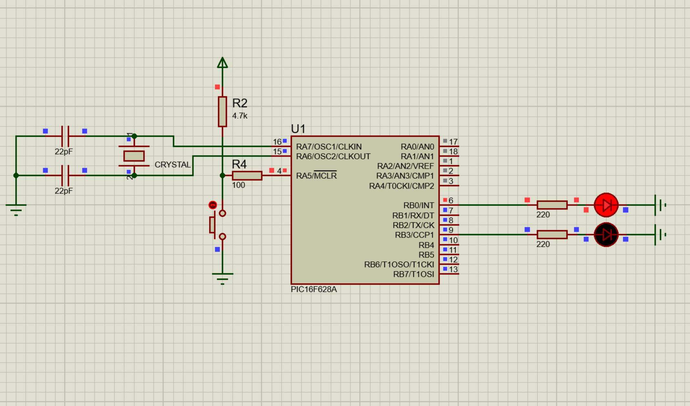
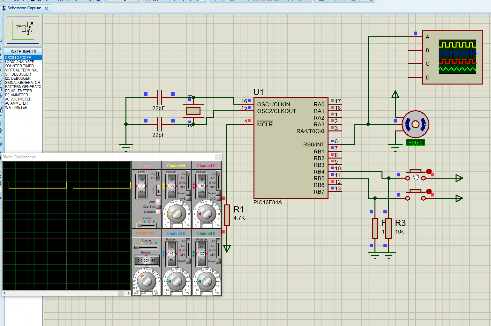

 
 

<!-- BAŞLIK -->
<h1> 
  

     Embedded Design Projects  (Microchip Microcontrollers)
  

</h1>

 
 

 
<!-- PIC18FXXXA PROJECTS -->
                        

<h4> PIC18FXXXA PROJECTS </h4> 
- <a href="https://github.com/enesmrcn/PIC-MCU-Projects/tree/main/PIC18-C-PROJECTS/ADC%20Introduction%20-%20PIC18F4520">  ADC Introduction - PIC18F4520 </a> 
- <a href="https://github.com/enesmrcn/PIC-MCU-Projects/tree/main/PIC18-C-PROJECTS/Bit%20Shifting%20-%20PIC18LF47J53">  Bit Shifting - PIC18LF47J53 </a> 
- <a href="https://github.com/enesmrcn/PIC-MCU-Projects/tree/main/PIC18-C-PROJECTS/Blinky%20-%20PIC18F4520">  Blinky - PIC18F4520 </a> 
- <a href="https://github.com/enesmrcn/PIC-MCU-Projects/tree/main/PIC18-C-PROJECTS/Button%20Read%20-%20PIC18F4520">  Button Read - PIC18F4520 </a> 
- <a href="https://github.com/enesmrcn/PIC-MCU-Projects/tree/main/PIC18-C-PROJECTS/Cascaded%207-Segment%20Displays%20-%20PIC18LF46J53">  Cascaded 7-Segment Displays - PIC18LF46J53 </a> 
- <a href="https://github.com/enesmrcn/PIC-MCU-Projects/tree/main/PIC18-C-PROJECTS/Clock%20-%20PIC18F4520">  Clock - PIC18F4520 </a> 
- <a href="https://github.com/enesmrcn/PIC-MCU-Projects/tree/main/PIC18-C-PROJECTS/Counting%20to%2099%20-%20PIC18LF46J53">  Counting to 99 - PIC18LF46J53 </a> 
- <a href="https://github.com/enesmrcn/PIC-MCU-Projects/tree/main/PIC18-C-PROJECTS/EEPROM%20Introduction%20-%20PIC18F4520">  EEPROM Introduction - PIC18F4520 </a> 
- <a href="https://github.com/enesmrcn/PIC-MCU-Projects/tree/main/PIC18-C-PROJECTS/Flashing%20LED%20-%20PIC18F2220">  Flashing LED - PIC18F2220 </a> 
- <a href="https://github.com/enesmrcn/PIC-MCU-Projects/tree/main/PIC18-C-PROJECTS/Flipping%20LEDs%20-%20PIC18F2220">  Flipping LEDs - PIC18F2220 </a> 
- <a href="https://github.com/enesmrcn/PIC-MCU-Projects/tree/main/PIC18-C-PROJECTS/I2C%20DS1307%20-%20PIC18F4520">  I2C DS1307 - PIC18F4520 </a> 
- <a href="https://github.com/enesmrcn/PIC-MCU-Projects/tree/main/PIC18-C-PROJECTS/I2C%20Introduction%20-%20PIC18F4520">  I2C Introduction - PIC18F4520 </a> 
- <a href="https://github.com/enesmrcn/PIC-MCU-Projects/tree/main/PIC18-C-PROJECTS/Interrupts%20-%20PIC18F4520">  Interrupts - PIC18F4520 </a> 
- <a href="https://github.com/enesmrcn/PIC-MCU-Projects/tree/main/PIC18-C-PROJECTS/LCD%20Driving%20-%20PIC18F2220">  LCD Driving - PIC18F2220 </a> 
- <a href="https://github.com/enesmrcn/PIC-MCU-Projects/tree/main/PIC18-C-PROJECTS/LED%20Interface%20-%20PIC18F4520">  LED Interface - PIC18F4520 </a> 
- <a href="https://github.com/enesmrcn/PIC-MCU-Projects/tree/main/PIC18-C-PROJECTS/LED%20Shifting%20-%20PIC18F4520">  LED Shifting - PIC18F4520 </a> 
- <a href="https://github.com/enesmrcn/PIC-MCU-Projects/tree/main/PIC18-C-PROJECTS/PWM%20Forward%20Wave%20-%20PIC18LF46J53">  PWM Forward Wave - PIC18LF46J53 </a> 
- <a href="https://github.com/enesmrcn/PIC-MCU-Projects/tree/main/PIC18-C-PROJECTS/Reading%20Switch%20-%20PIC18F2220">  Reading Switch - PIC18F2220 </a> 
- <a href="https://github.com/enesmrcn/PIC-MCU-Projects/tree/main/PIC18-C-PROJECTS/Seven%20Segment%20-%20PIC18F2220">  Seven Segment - PIC18F2220 </a> 
- <a href="https://github.com/enesmrcn/PIC-MCU-Projects/tree/main/PIC18-C-PROJECTS/Seven%20Segment%20-%20PIC18LF46J53">  Seven Segment - PIC18LF46J53 </a> 
- <a href="https://github.com/enesmrcn/PIC-MCU-Projects/tree/main/PIC18-C-PROJECTS/Timer0%2016bit%20-%20PIC18F4550">  Timer 0 16bit - PIC18F4550 </a> 
- <a href="https://github.com/enesmrcn/PIC-MCU-Projects/tree/main/PIC18-C-PROJECTS/Timer0%208bit%20-%20PIC18F4550">  Timer 0 8bit - PIC18F4550 </a> 
- <a href="https://github.com/enesmrcn/PIC-MCU-Projects/tree/main/PIC18-C-PROJECTS/Timer0%20Interrupt%20-%20PIC18F4520">  Timer 0 Interrupt - PIC18F4520 </a> 
- <a href="https://github.com/enesmrcn/PIC-MCU-Projects/tree/main/PIC18-C-PROJECTS/Timer1%20Binary%20Counter%20-%20PIC18LF46J53">  Timer 1 Binary Counter - PIC18LF46J53 </a> 
- <a href="https://github.com/enesmrcn/PIC-MCU-Projects/tree/main/PIC18-C-PROJECTS/Timer2%20Counter%20-%20PIC18LF46J53">  Timer 2 Counter - PIC18LF46J53 </a> 
- <a href="https://github.com/enesmrcn/PIC-MCU-Projects/tree/main/PIC18-C-PROJECTS/UART%20Full-Dublex%20Project%20-%20PIC18F4520">  UART Full-Dublex Project - PIC18F4520 </a> 
- <a href="https://github.com/enesmrcn/PIC-MCU-Projects/tree/main/PIC18-C-PROJECTS/UART%20Introduction%20-%20PIC18F4520">  UART Introduction - PIC18F4520 </a> 
- <a href="https://github.com/enesmrcn/PIC-MCU-Projects/tree/main/PIC18-C-PROJECTS/USART%20-%20PIC18F4520">  USART - PIC18F4520 </a> 

 

<h1> 
  

  

</h1>

<!-- PIC16FXXXA PROJECTS -->

<h4> PIC16FXXXA PROJECTS </h4> 
- <a href="https://github.com/enesmrcn/PIC-MCU-Projects/tree/main/PIC16-C-PROJECTS/00_helloWorldLED">  00_helloWorldLED </a> 
- <a href="https://github.com/enesmrcn/PIC-MCU-Projects/tree/main/PIC16-C-PROJECTS/01_blinky_1.0">  01_blinky_1.0 </a> 
- <a href="https://github.com/enesmrcn/PIC-MCU-Projects/tree/main/PIC16-C-PROJECTS/02_blinky_2.0">  02_blinky_2.0 </a> 
- <a href="https://github.com/enesmrcn/PIC-MCU-Projects/tree/main/PIC16-C-PROJECTS/03_blinky_3.0">  03_blinky_3.0 </a> 
- <a href="https://github.com/enesmrcn/PIC-MCU-Projects/tree/main/PIC16-C-PROJECTS/04_LedButton">  04_LedButton </a> 
- <a href="https://github.com/enesmrcn/PIC-MCU-Projects/tree/main/PIC16-C-PROJECTS/05_readingPins_v1.0">  05_readingPins_v1.0 </a> 
- <a href="https://github.com/enesmrcn/PIC-MCU-Projects/tree/main/PIC16-C-PROJECTS/06_flipFlop_v1.0">  06_flipFlop_v1.0 </a> 
- <a href="https://github.com/enesmrcn/PIC-MCU-Projects/tree/main/PIC16-C-PROJECTS/07_flipFlop_v2.0">  07_flipFlop_v2.0 </a> 
- <a href="https://github.com/enesmrcn/PIC-MCU-Projects/tree/main/PIC16-C-PROJECTS/08_counter_v1.0">  08_counter_v1.0 </a> 
- <a href="https://github.com/enesmrcn/PIC-MCU-Projects/tree/main/PIC16-C-PROJECTS/09_counterButton">  09_counterButton </a> 
- <a href="https://github.com/enesmrcn/PIC-MCU-Projects/tree/main/PIC16-C-PROJECTS/10_knightRider_v1.0">  10_knightRider_v1.0 </a> 
- <a href="https://github.com/enesmrcn/PIC-MCU-Projects/tree/main/PIC16-C-PROJECTS/11_kinghtRider_v2.0">  11_kinghtRider_v2.0 </a> 
- <a href="https://github.com/enesmrcn/PIC-MCU-Projects/tree/main/PIC16-C-PROJECTS/12_interruptExternal">  12_interruptExternal </a> 
- <a href="https://github.com/enesmrcn/PIC-MCU-Projects/tree/main/PIC16-C-PROJECTS/13_interruptPortB">  13_interruptPortB </a> 
- <a href="https://github.com/enesmrcn/PIC-MCU-Projects/tree/main/PIC16-C-PROJECTS/14_interruptPortB">  14_interruptPortB </a> 
- <a href="https://github.com/enesmrcn/PIC-MCU-Projects/tree/main/PIC16-C-PROJECTS/15_interruptRB0">  15_interruptRB0 </a> 
- <a href="https://github.com/enesmrcn/PIC-MCU-Projects/tree/main/PIC16-C-PROJECTS/16_timer0">  16_timer0 </a> 
- <a href="https://github.com/enesmrcn/PIC-MCU-Projects/tree/main/PIC16-C-PROJECTS/17_timer0_exercise"> 17_timer0_exercise </a> 
- <a href="https://github.com/enesmrcn/PIC-MCU-Projects/tree/main/PIC16-C-PROJECTS/18_timer0">  18_timer0 </a> 
- <a href="https://github.com/enesmrcn/PIC-MCU-Projects/tree/main/PIC16-C-PROJECTS/19_timer1">  19_timer1 </a> 
- <a href="https://github.com/enesmrcn/PIC-MCU-Projects/tree/main/PIC16-C-PROJECTS/20_timer2">  20_timer2 </a> 
- <a href="https://github.com/enesmrcn/PIC-MCU-Projects/tree/main/PIC16-C-PROJECTS/21_captureModule">  21_captureModule </a> 
- <a href="https://github.com/enesmrcn/PIC-MCU-Projects/tree/main/PIC16-C-PROJECTS/22_compareModule">  22_compareModule </a> 
- <a href="https://github.com/enesmrcn/PIC-MCU-Projects/tree/main/PIC16-C-PROJECTS/23_captureCompareExercise">  23_captureCompareExercise </a> 
- <a href="https://github.com/enesmrcn/PIC-MCU-Projects/tree/main/PIC16-C-PROJECTS/24_captureModeChange">  24_captureModeChange </a> 
- <a href="https://github.com/enesmrcn/PIC-MCU-Projects/tree/main/PIC16-C-PROJECTS/25_dcMotorDriving">  25_dcMotorDriving </a> 
- <a href="https://github.com/enesmrcn/PIC-MCU-Projects/tree/main/PIC16-C-PROJECTS/25_dcMotorDriving">  25_dcMotorDriving </a> 
- <a href="https://github.com/enesmrcn/PIC-MCU-Projects/tree/main/PIC16-C-PROJECTS/26_dcMotorPWM">  26_dcMotorPWM </a> 
- <a href="https://github.com/enesmrcn/PIC-MCU-Projects/tree/main/PIC16-C-PROJECTS/27_drivingStep">  27_drivingStep </a> 
- <a href="https://github.com/enesmrcn/PIC-MCU-Projects/tree/main/PIC16-C-PROJECTS/28_eeprom">  28_eeprom </a> 
- <a href="https://github.com/enesmrcn/PIC-MCU-Projects/tree/main/PIC16-C-PROJECTS/29_matrixLedDriving">  29_matrixLedDriving </a> 
- <a href="https://github.com/enesmrcn/PIC-MCU-Projects/tree/main/PIC16-C-PROJECTS/30_pwmSquareWave">  30_pwmSquareWave </a> 
- <a href="https://github.com/enesmrcn/PIC-MCU-Projects/tree/main/PIC16-C-PROJECTS/31_segment7Driving">  31_segment7Driving </a> 
- <a href="https://github.com/enesmrcn/PIC-MCU-Projects/tree/main/PIC16-C-PROJECTS/32_segment7Counter">  32_segment7Counter </a> 
- <a href="https://github.com/enesmrcn/PIC-MCU-Projects/tree/main/PIC16-C-PROJECTS/33_segment7DrivingTransistor">  33_segment7DrivingTransistor </a> 
- <a href="https://github.com/enesmrcn/PIC-MCU-Projects/tree/main/PIC16-C-PROJECTS/34_servoDrivingBasics">  33_segment7DrivingTransistor </a> 
- <a href="https://github.com/enesmrcn/PIC-MCU-Projects/tree/main/PIC16-C-PROJECTS/33_segment7DrivingTransistor">  34_servoDrivingBasics </a> 

 
 
 
  
 
 

<h1> 
  

  

</h1>

<!-- GÖRSELLER PIC18F -->

 

<!-- BAŞLIK -->
<h1> 
  

     PIC18 Projects
  

</h1>

<!-- AÇILIŞ -->
<h2> 
   
   
     
     
  

     <a href="https://github.com/enesmrcn/PIC-MCU-Projects/tree/main/PIC18-C-PROJECTS/UART%20Full-Dublex%20Project%20-%20PIC18F4520"> UART Full-Dublex Project </a>
     
     
     
  

 
 
  
  

</h2>

<!-- KAPANIŞ -->

<!-- AÇILIŞ -->
<h2> 
   
     
     
  

     <a href="https://github.com/enesmrcn/PIC-MCU-Projects/tree/main/PIC18-C-PROJECTS/Cascaded%207-Segment%20Displays%20-%20PIC18LF46J53"> Cascaded 7-Segment Displays </a>
     
     
     
  

 
 
  
  

</h2>

<!-- KAPANIŞ -->

<!-- AÇILIŞ -->
<h2> 
   
     
     
  

     <a href="https://github.com/enesmrcn/PIC-MCU-Projects/tree/main/PIC18-C-PROJECTS/I2C%20DS1307%20-%20PIC18F4520"> I2C DS1307 - PIC18F4520 </a>
     
     
     
  

 
 
  
  

</h2>

<!-- KAPANIŞ -->

<!-- AÇILIŞ -->
<h2> 
   
     
     
  

     <a href="https://github.com/enesmrcn/PIC-MCU-Projects/tree/main/PIC18-C-PROJECTS/Counting%20to%2099%20-%20PIC18LF46J53"> Counting to 99 - PIC18LF46J53 </a>
     
     
     
  

 
 
  
  

</h2>

<!-- KAPANIŞ -->

<!-- AÇILIŞ -->
<h2> 
   
     
     
  

     <a href="https://github.com/enesmrcn/PIC-MCU-Projects/tree/main/PIC18-C-PROJECTS/PWM%20Forward%20Wave%20-%20PIC18LF46J53"> PWM Forward Wave - PIC18LF46J53 </a>
     
     
     
  

 
 
  
  

</h2>

<!-- KAPANIŞ -->

<!-- AÇILIŞ -->
<h2> 
   
     
     
  

     <a href="https://github.com/enesmrcn/PIC-MCU-Projects/tree/main/PIC18-C-PROJECTS/ADC%20Introduction%20-%20PIC18F4520"> Introduction to Analog Read (ADC) </a>
     
     
     
  

 
 
  
  

</h2>

<!-- KAPANIŞ -->

<!-- AÇILIŞ -->
<h2> 
   
     
     
  

     <a href="https://github.com/enesmrcn/PIC-MCU-Projects/tree/main/PIC18-C-PROJECTS/Timer1%20Binary%20Counter%20-%20PIC18LF46J53"> Timer1 Binary Counter - PIC18LF46J53 </a>
     
     
     
  

 
 
  
  

</h2>

<!-- KAPANIŞ -->

<!-- AÇILIŞ -->
<h2> 
   
     
     
  

     <a href="https://github.com/enesmrcn/PIC-MCU-Projects/tree/main/PIC18-C-PROJECTS/USART%20-%20PIC18F4520"> USART - PIC18f4520 </a>
     
     
     
  

 
 
  
  

</h2>

<!-- KAPANIŞ -->

<!-- GÖRSELLER PIC16-->

 

<!-- BAŞLIK -->
<h1> 
  

     PIC16 Projects
  

</h1>

<!-- AÇILIŞ -->
<h2> 
   
     
     
  

     <a href="https://github.com/enesmrcn/PIC-MCU-Projects/tree/main/PIC18-C-PROJECTS/UART%20Full-Dublex%20Project%20-%20PIC18F4520"> Hello World </a>
     
     
     
  

 
 
  
  

</h2>

<!-- KAPANIŞ -->

<!-- AÇILIŞ -->
<h2> 
   
     
     
  

     <a href="https://github.com/enesmrcn/PIC-MCU-Projects/tree/main/PIC16-C-PROJECTS/05_readingPins_v1.0"> Port Reading </a>
     
     
     
  

 
 
  
  

</h2>

<!-- KAPANIŞ -->

<!-- AÇILIŞ -->
<h2> 
   
     
     
  

     <a href="https://github.com/enesmrcn/PIC-MCU-Projects/tree/main/PIC16-C-PROJECTS/11_kinghtRider_v2.0"> Kinght Rider v2 </a>
     
     
     
  

 
 
  
  

</h2>

<!-- KAPANIŞ -->

<!-- AÇILIŞ -->
<h2> 
   
     
     
  

     <a href="https://github.com/enesmrcn/PIC-MCU-Projects/tree/main/PIC16-C-PROJECTS/12_interruptExternal"> External Interrupt </a>
     
     
     
  

 
 
  
  

</h2>

<!-- KAPANIŞ -->

<!-- AÇILIŞ -->
<h2> 
   
     
     
  

     <a href="https://github.com/enesmrcn/PIC-MCU-Projects/tree/main/PIC16-C-PROJECTS/13_interruptPortB"> Port-B Interrupts </a>
     
     
     
  

 
 
  
  

</h2>

<!-- KAPANIŞ -->

<!-- AÇILIŞ -->
<h2> 
   
     
     
  

     <a href="https://github.com/enesmrcn/PIC-MCU-Projects/tree/main/PIC16-C-PROJECTS/15_interruptRB0"> RB0 Interrupts </a>
     
     
     
  

 
 
  
  

</h2>

<!-- KAPANIŞ -->

<!-- AÇILIŞ -->
<h2> 
   
     
     
  

     <a href="https://github.com/enesmrcn/PIC-MCU-Projects/tree/main/PIC16-C-PROJECTS/16_timer0"> Timer-0  </a>
     
     
     
  

 
 
  
  

</h2>

<!-- KAPANIŞ -->

<!-- AÇILIŞ -->
<h2> 
   
     
     
  

     <a href="https://github.com/enesmrcn/PIC-MCU-Projects/tree/main/PIC16-C-PROJECTS/25_dcMotorDriving"> DC Motor Driving </a>
     
     
     
  

 
 
  
  

</h2>

<!-- KAPANIŞ -->

<!-- AÇILIŞ -->
<h2> 
   
     
     
  

     <a href="https://github.com/enesmrcn/PIC-MCU-Projects/tree/main/PIC16-C-PROJECTS/27_drivingStep"> Stepper Motor Driving </a>
     
     
     
  

 
 
  
  

</h2>

<!-- KAPANIŞ -->

<!-- AÇILIŞ -->
<h2> 
   
     
     
  

     <a href="https://github.com/enesmrcn/PIC-MCU-Projects/tree/main/PIC16-C-PROJECTS/29_matrixLedDriving"> Matrix Led Driving </a>
     
     
     
  

 
 
  
  

</h2>

<!-- KAPANIŞ -->

<!-- AÇILIŞ -->
<h2> 
   
     
     
  

     <a href="https://github.com/enesmrcn/PIC-MCU-Projects/tree/main/PIC16-C-PROJECTS/30_pwmSquareWave"> PWM Generation </a>
     
     
     
  

 
 
  
  

</h2>

<!-- KAPANIŞ -->

<!-- AÇILIŞ -->
<h2> 
   
     
     
  

     <a href="https://github.com/enesmrcn/PIC-MCU-Projects/tree/main/PIC16-C-PROJECTS/31_segment7Driving"> Generic 7-Segment Driving </a>
     
     
     
  

 
 
  
  

</h2>

<!-- KAPANIŞ -->

<!-- AÇILIŞ -->
<h2> 
   
     
     
  

     <a href="https://github.com/enesmrcn/PIC-MCU-Projects/tree/main/PIC16-C-PROJECTS/32_segment7Counter"> 7-Segment Driving (Scanning Methode)</a>
     
     
     
  

 
 
  
  

</h2>

<!-- KAPANIŞ -->

<!-- AÇILIŞ -->
<h2> 
   
     
     
  

     <a href="https://github.com/enesmrcn/PIC-MCU-Projects/tree/main/PIC16-C-PROJECTS/33_segment7DrivingTransistor"> 7-Segment with Transistor </a>
     
     
     
  

 
 
  
  

</h2>

<!-- KAPANIŞ -->

<!-- AÇILIŞ -->
<h2> 
   
     
     
  

     <a href="https://github.com/enesmrcn/PIC-MCU-Projects/tree/main/PIC16-C-PROJECTS/34_servoDrivingBasics"> Servo Driving </a>
     
     
     
  

 
 
  
  

</h2>

<!-- KAPANIŞ -->

<!-- SHIELDS -->

  <!-- Visitors badge: -->
  
